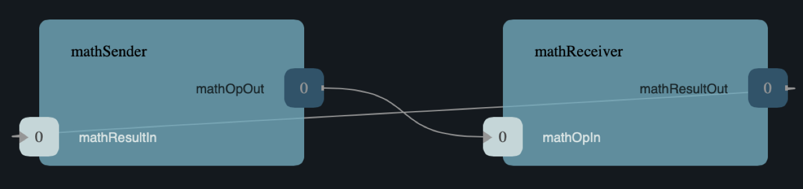

# MathComponent Tutorial 

Welcome to the MathComponent tutorial!

This tutorial shows how to develop, test, and deploy a simple topology
consisting of two components:

1. `MathSender`: A component that receives commands and forwards work to
   `MathReceiver`.

2. `MathReceiver`: A component that carries out arithmetic operations and
   returns the results to `MathSender`.

See the diagram below.

## What is covered
This tutorial will cover the following concepts:

1. Defining types, ports, and components in F'. 

2. Creating a deployment and running the F' GDS (Ground Data System). 

3. Writing unit tests.

4. Handling errors, creating events, and adding telemetry channels. 

## Prerequisites 
This tutorial assumes the following:

1. Basic knowledge of Unix: How to navigate in a shell and execute programs.

2. Basic knowledge of C++.

3. We advise new F' users to try the [HelloWorld Tutorial](https://fprime-community.github.io/fprime-tutorial-hello-world/)

## Table of Contents

1. [Project Setup](/docs/project-setup.md)
2. [Defining Types](/docs/defining-types.md)
3. [Constructing Ports](/docs/constructing-ports.md)
4. [Creating Components](/docs/creating-components-1.md)
5. [Developing Deployments](/docs/developing-deployments.md)
6. [Writing Unit Tests](/docs/writing-unit-tests-1.md)
7. [Adding Telemetry](/docs/adding-telemetry.md)
8. [Error handling](/docs/error-handling-1.md)

**Next:** [Start the MathComponent Tutorial: Project Setup](./docs/project-setup.md)